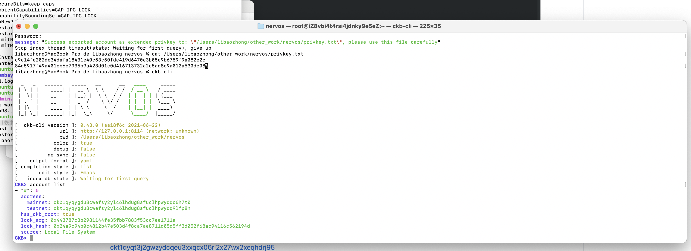
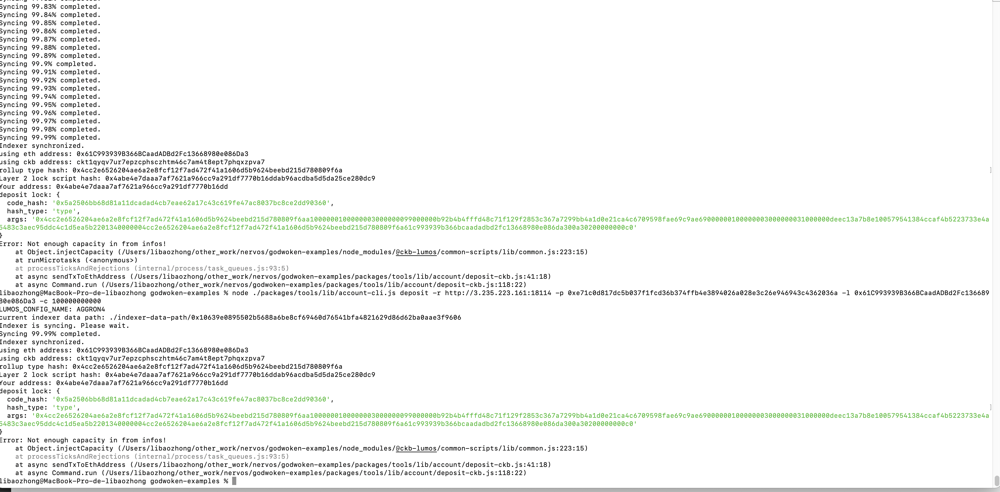

Task 1
===
1. A screenshot of the accounts you created (account list) in ckb-cli.

2. A link to the Layer 1 address you funded on the Testnet Explorer:

[ckt1qyqygdu8cwefsy2ylc6lhdug8afuclhpwydq9lfp8n](https://explorer.nervos.org/aggron/address/ckt1qyqygdu8cwefsy2ylc6lhdug8afuclhpwydq9lfp8n)

3. A screenshot of the console output immediately after you have successfully submitted a deposit to Layer 2.
command exec need two day or more ;

